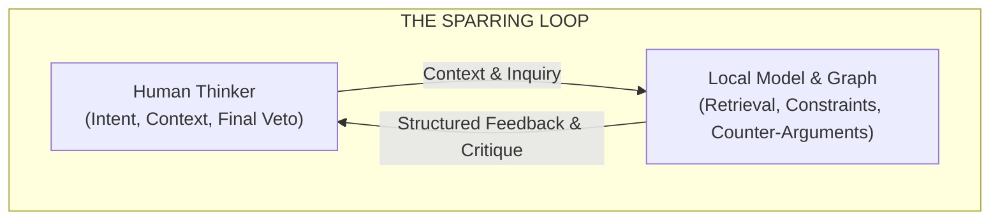
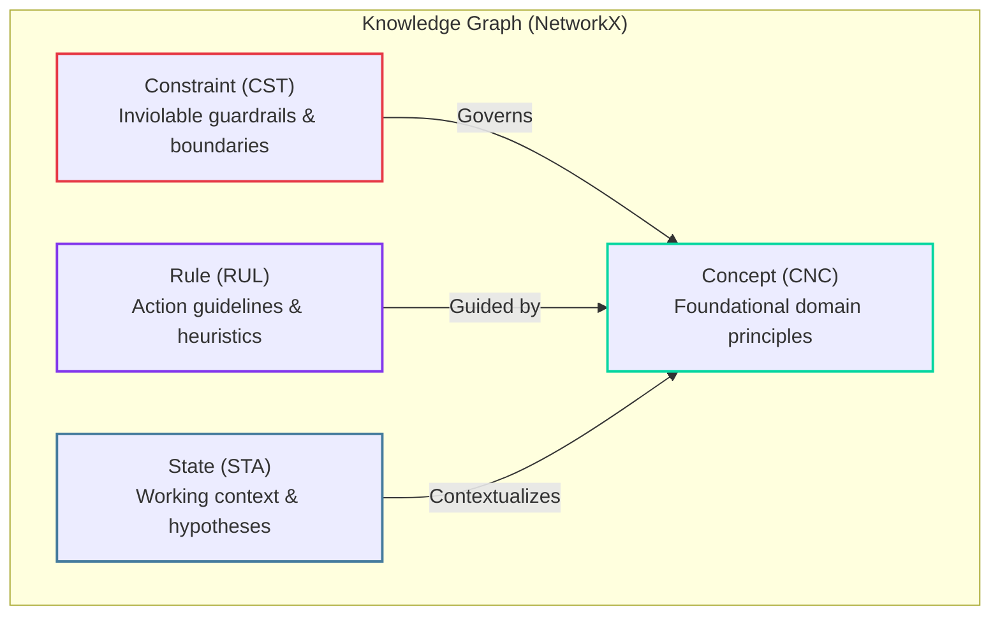
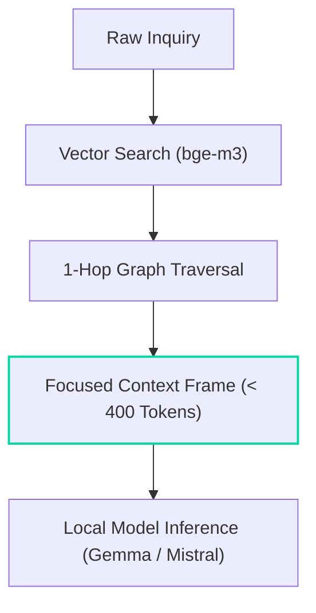

> *"The hope is that, in not too many years, human brains and computing machines will be coupled together very tightly, and that the resulting partnership will think as no human brain has ever thought."*  
> — J.C.R. Licklider, *Man-Computer Symbiosis* (1960)

The **Exocortex** is neither an autonomous agent nor a generic prompt wrapper. It is a **local-first thinking partner** built on plain-text notes, a structured knowledge graph (NetworkX + `bge-m3` embeddings), and clear architectural constraints. 

Instead of dumping massive chat logs into sprawling context windows or letting an agent act unchecked in the background, Exocortex uses explicit graph structures to ground local models, prevent blind agreement (*sycophancy*), and keep discussions focused and substantive.

---

## 1. Collaboration Without Delegation



### 1.1 The Licklider Paradigm: Partnership, Not Replacement

AI workflows often fall into two unproductive extremes:

1. **Unchecked Autonomous Agents:** The model runs in an open loop, compounding small errors and hallucinations until the human loses track of what the code or system actually does.
2. **Passive Chatbots:** Ephemeral conversational interfaces without persistent memory, structural context, or the willingness to challenge flawed premises.

Exocortex follows J.C.R. Licklider’s vision of **Man-Computer Symbiosis**:

* **The Human:** Sets the direction, evaluates real-world trade-offs, exercises aesthetic and ethical judgment, and holds the final veto.
* **The Machine:** Retrieves related notes, verifies structural consistency, points out overlooked edge cases, and drafts refactoring options rapidly.

### 1.2 Anti-Sycophancy & Constructive Critique

Models trained via RLHF are tuned to be polite and agreeable. In technical work, this manifests as **sycophancy**: the model validates flawed designs, ignores bad assumptions, and generates plausible-sounding rationalizations for fragile code.

Exocortex counters this by injecting explicit **Constraints (`CST`)**. The system is instructed to act as a candid sounding board: point out missing error handling, highlight coupling issues, and challenge vague premises before answering.

### 1.3 Popperian Demarcation: Defining Systems by What They Forbid

In Karl Popper's *The Logic of Scientific Discovery* (1934), a theory is only as strong as what it forbids:

> *"Every 'good' scientific theory is a prohibition: it forbids certain things to happen."*

We apply this directly to architecture and prompts:

* **Unfalsifiable Sprawl:** Systems without clear boundaries accumulate defensive bloat, broad `catch-all` exception handlers, and bloated interfaces that attempt to anticipate every hypothetical edge case.
* **Via Negativa (Constraint-First Design):** Clean systems define hard boundaries. A constraint explicitly forbids unwanted behavior (e.g., "no side effects inside pure calculation functions", "no unseasonal produce in recipes"). The solution space inside those walls remains completely open.

---

## 2. The Structured Memory Graph

Instead of maintaining a flat, unstructured history, Exocortex models domain knowledge as a typed, directed graph.



### 2.1 Node Taxonomy

The graph categorizes concepts into four pragmatic types with canonical prefixes:

| Prefix | Node Type | Role | Practical Example |
| --- | --- | --- | --- |
| **`CST_`** | **Constraint** | Inviolable invariant / boundary | "Functions must not mix database writes with network I/O." |
| **`CNC_`** | **Concept** | Foundational principle / model | "Single Responsibility" or "Vegetable Dashi Base". |
| **`RUL_`** | **Rule** | Action guideline / heuristic | "Decouple via interfaces" or "Dry-toast buckwheat before simmering". |
| **`STA_`** | **State** | Working context / checkpoint | Active code review hypothesis or temporary task marker. |

### 2.2 Graph Maintenance & Tool Control

The model does not edit markdown notes at random. Instead, it maintains and updates this structured mental model by reading and mutating the underlying knowledge graph (in-memory NetworkX state, persisted to JSON and synced to an Obsidian `.canvas`) via explicit tool calls:

* **`exocortex_query_graph`**: Searches the active graph using cosine vector similarity (`bge-m3`) and 1-hop traversal to retrieve relevant concepts and constraints before answering.
* **`exocortex_create_node`**: Autonomously materializes a new structured node (`Constraint`, `Concept`, `Rule`, or `State`), embeds its payload, and automatically links it to related existing nodes.
* **`exocortex_mutate_node`**: Updates node payloads, calibrates relevance weights (`STRENGTHEN`, `DECAY`), or prunes obsolete working hypotheses to keep the graph clean.

---

## 3. Context Economy & Focus



### 3.1 The Flaw of Infinite Context

Modern LLMs support massive context windows (100k to 2M tokens). However, treating context as a dumping ground creates distinct problems:

1. **Attention Degradation ("Lost in the Middle"):** Critical system rules get drowned out by conversational filler.
2. **Computational Inefficiency:** Processing hundreds of thousands of tokens for a simple query wastes local GPU memory and increases latency.

### 3.2 Focused Context Frames

Exocortex uses a **hybrid retrieval strategy**:

1. **Semantic Search:** The user prompt is vectorized via `bge-m3` to locate the most relevant core nodes.
2. **Graph Traversal:** The engine traverses direct edges (1-hop) in the NetworkX graph to pull immediate contextual neighbors without explicit prompting.
3. **Frame Assembly:** The active constraints and retrieved nodes are assembled into a compact prompt frame ($< 400$ tokens).

This gives a lightweight $12\text{B}$ local model the precision of a much larger system without latency overhead.

---

## 4. Externalized Vault & Visual Sync

A thinking partner must not trap knowledge in a proprietary database. Exocortex stores its persistent state in plain Markdown and standard JSON:

* **Obsidian Canvas Synchronization:** The in-memory NetworkX graph automatically exports to an Obsidian `.canvas` file. You can inspect, rearrange, or edit the graph visually inside your vault in real time.
* **Controlled Write Access:** The model has read access to relevant vault notes, but write access is strictly isolated to a single designated scratchpad (`Active_Scratchpad.md`). Permanent notes remain untouched until you review and integrate the ideas yourself.

---

## 5. Human Agency & Cognitive Sharpening

```text
┌────────────────────────────────────────────────────────┐
│                THE BOUNDARY OF AGENCY                  │
│                                                        │
│   VIA NEGATIVA (Guardrails)     VIA POSITIVA (Cage)    │
│   ─────────────────────────     ───────────────────    │
│   • Sets boundaries & limits    • Dictates conclusion  │
│   • Highlights flaws & risks    • Unasked advice       │
│   • Keeps reasoning open        • Automates judgment   │
└────────────────────────────────────────────────────────┘

```

### 5.1 Ashby's Law & Preventing Cognitive Atrophy

Under W. Ross Ashby's *Law of Requisite Variety*, an operator who delegates all critical thinking to an automated system gradually loses the internal capacity needed to understand and debug that system.

When developers blindly accept auto-generated code blocks, their mental model decays. Exocortex is designed as a **critical mirror**:

* It explains *why* an approach has flaws.
* It surfaces trade-offs rather than making unilateral decisions.
* It encourages the human to stay actively engaged with the architecture.

### 5.2 Division of Responsibilities

1. **Verification Can Be Delegated:** The model can spot syntax errors, race conditions, tight coupling, and logical inconsistencies.
2. **Intent Cannot Be Delegated:** Direction, taste, core values, and final decisions reside strictly with the human.

---

## 6. Runtime Telemetry

To verify that answers remain substantive and constructive without manual inspection of every turn, Exocortex calculates two lightweight telemetry scores:

### 6.1 Echo Score ($\rho_{\text{echo}}$)

Measures the cosine similarity between the user prompt $\mathbf{p}$ and the model response $\mathbf{r}$:

$$\rho_{\text{echo}} = \frac{\mathbf{p} \cdot \mathbf{r}}{\|\mathbf{p}\|_2 \, \|\mathbf{r}\|_2}$$

> *Note: These threshold ranges are empirical heuristics, not strict mathematical laws. Treat them as navigational indicators alongside your own critical judgment.*

* **$\rho_{\text{echo}} > 0.85$ (Sycophancy / Echoing):** The model merely rewords what the user said without adding new insight.
* **$\rho_{\text{echo}} < 0.30$ (Topic Drift):** The model has derailed and lost the original thread.
* **$\rho_{\text{echo}} \approx 0.50 - 0.70$ (Optimal Sparring):** The model addresses the topic directly while introducing independent structure, critique, or solutions.

### 6.2 Epistemic Lift ($\Delta E$)

Measures whether the response actively moved closer to the ground-truth principles $\mathbf{c}$ activated in the knowledge graph:

$$\Delta E = \text{sim}(\mathbf{r}, \mathbf{c}) - \text{sim}(\mathbf{p}, \mathbf{c})$$

* **$\Delta E > 0$:** The response grounded its reasoning in established graph principles rather than generating unconstrained completions.
* **$\Delta E \approx 0$:** Open exploration or general problem-solving without heavy reliance on active concept nodes.

---

## 7. Tool Protocol & Anti-Deskilling (FastMCP)

Rather than building an opaque autonomous agent that acts in the background, Exocortex exposes its core capabilities strictly as standardized **Model Context Protocol (MCP)** tools via FastMCP. This architectural boundary enforces human agency at the runtime level:

1. **Atomic & Visible Actions:**  
   The model does not execute silent background loops. Every action—querying the graph, retrieving a note, or proposing a node mutation—is an explicit, typed tool call surfaced in real time to the operator.
2. **Strict Quarantined Writes:**  
   The model has broad read access across your notes, but write access is strictly quarantined to a single file (`Active_Scratchpad.md`). It cannot silently overwrite repository code or vault notes. Final integration remains 100% manual and human.
3. **Synchronized External Memory:**  
   When the model calls `exocortex_create_node` or `exocortex_mutate_node`, the change is immediately written to the active NetworkX graph and projected into your Obsidian `.canvas`. The evolving mental model remains visual, inspectable, and editable by the operator at all times.

FastMCP transforms the LLM from an uninspected autopilot into an auditable thinking instrument on your dashboard.
