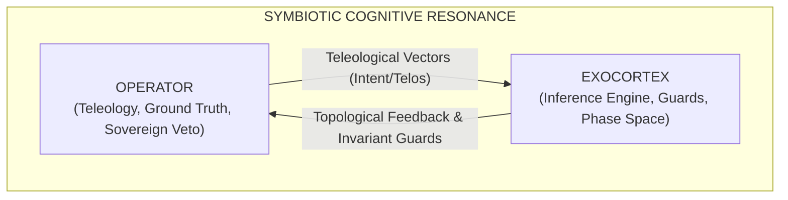
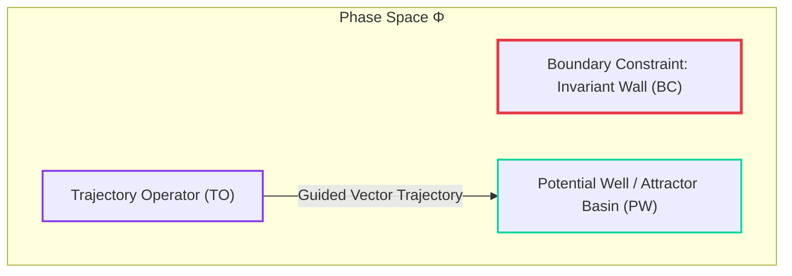
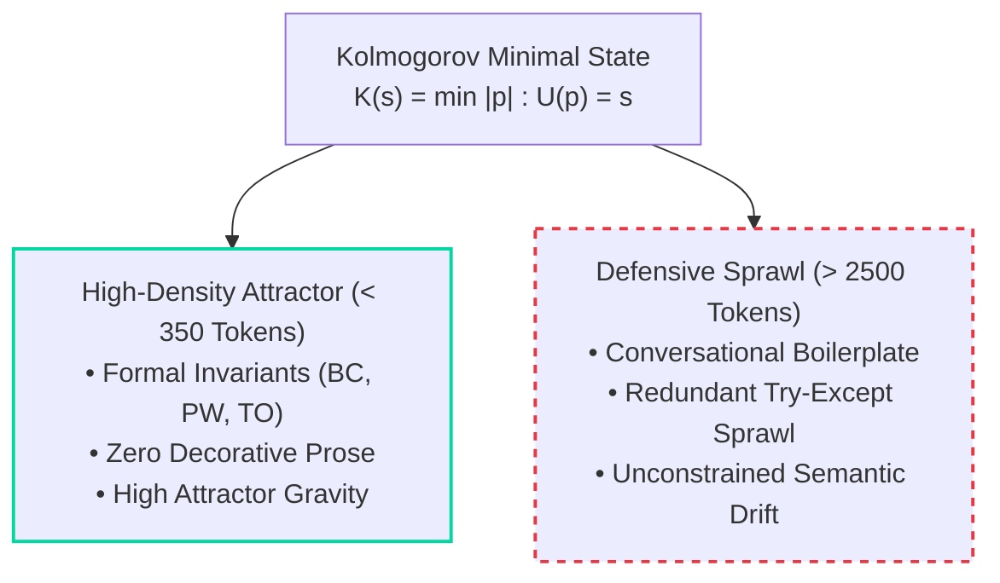
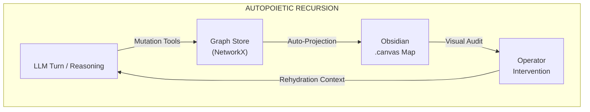
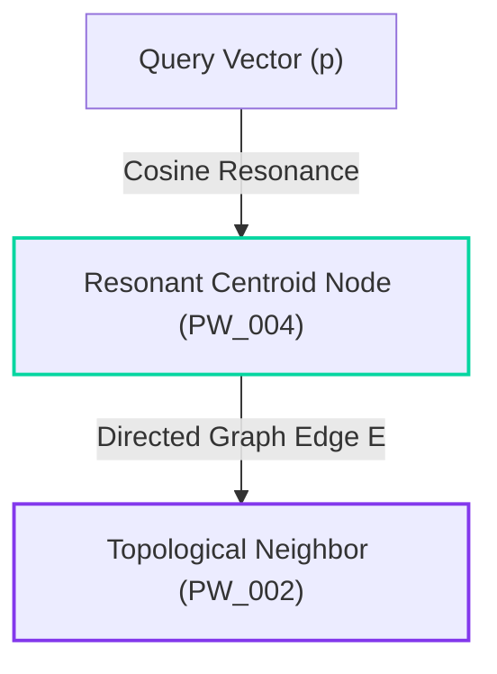

> **A Topological Architecture for Symbiotic Cognition, Second-Order Cybernetics, and Invariant Preservation.**

The [[index|Exocortex]] is not an autonomous agent, nor is it a passive prompt wrapper. It is an **open-source, deterministic epistemic substrate** engineered to instantiate *Man-Computer Symbiosis* (J.C.R. Licklider, 1960). By mapping high-dimensional semantic spaces into a discrete, typed phase-space graph (NetworkX + Vector Embeddings via `bge-m3`), the Exocortex grounds generative language models in explicit invariant constraints, eliminates sycophantic drift, and minimizes algorithmic Kolmogorov complexity.

---

## 1. Epistemology & Second-Order Cybernetics



### 1.1 The Licklider Symbiosis Paradigm (1960)

Contemporary AI deployment oscillates between two failure modes:

1. **Unconstrained Delegation (Autonomous Black-Box Agents):** The model operates in an open loop, compounding micro-ambiguities exponentially ($\mathcal{O}((1+\epsilon)^N)$) until it hallucinates defensive code sprawl.
2. **Trivial Assistance (Reactive Chatbots):** Epistemically sterile interfaces without memory, topological grounding, or state persistence.

The Exocortex implements J.C.R. Licklider's *Man-Computer Symbiosis*:

* **The Operator:** Provides the teleological vector (purpose/intent), sensory ground truth, semantic taste, and the sovereign architectural veto.
* **The Substrate (Exocortex):** Executes hyper-associative retrieval, formal invariant validation, topological graph resonance, and structural code refactoring at silicon speed.

### 1.2 Anti-Sycophancy & The Observer Constraint (Heinz von Foerster)

Under Second-Order Cybernetics, the observer is inherently recursive with the observed system:

$$\mathcal{S}_{n+1} = \mathcal{O}(\mathcal{S}_n, \mathcal{I})$$

Generative LLMs fine-tuned via RLHF suffer from severe **sycophancy**—the pathological tendency to confirm the operator's unexamined biases. Without negative feedback, the human-AI interaction degenerates into an autologous hallucination loop (see [[dispatches/2026-08-25-deconstructing-remote-viewing-ai|Dispatch 001]]).

The Exocortex mitigates this via explicit **Boundary Constraints (`BC`)**. The system is epistemically constrained to challenge false premises, demand empirical falsification, and expose conceptual drift before executing state transitions.

### 1.3 Popperian Demarcation: Code as Falsifiable Theory

In Karl Popper’s *The Logic of Scientific Discovery* (1934), the empirical content of a theory is measured by the severity of its prohibitions:

> *"Every 'good' scientific theory is a prohibition: it forbids certain things to happen."*

* **Defensive Sprawl (Non-Falsifiable):** Codebases filled with broad `catch-all` handlers, arbitrary fallbacks, and bloated type unions mimic unfalsifiable pseudo-theories—they accept any state and explain nothing.
* **Exocortex Invariance (Popperian):** An architecture is defined strictly by its constraints. A `BoundaryConstraint` explicitly forbids invalid states (e.g., side effects across bounded contexts, global state mutations, orphan tool calls) via [[garden/via-negativa|Via Negativa]].

---

## 2. Topological Phase Space & Attractor Dynamics

Inference is modeled not as a probabilistic text stream, but as a **trajectory through a high-dimensional semantic phase space** $\Phi$.



### 2.1 Morphogenetic Taxonomies (Waddington & Thom)

Drawing from C.H. Waddington’s epigenetic landscapes and René Thom’s catastrophe theory, the cognitive manifold is structured into four orthogonal node types:

| Taxonomy | Phase-Space Role | Color Code | Epistemic Function |
| --- | --- | --- | --- |
| **`BoundaryConstraint` (BC)** | Invariant Wall | **Red (`1`)** | Prohibits invalid regions of the solution space (e.g., side-effect leakage, sycophancy, mutation of base topologies). |
| **`PotentialWell` (PW)** | Attractor Basin | **Cyan (`5`)** | Gravitational epistemic well pulling inference toward foundational principles (e.g., First Principles, Kolmogorov minimality). |
| **`TrajectoryOperator` (TO)** | Vector Operator | **Purple (`3`)** | Directed transformation rule governing transitions between attractor states (e.g., Decoupling Refactors, Static Verification). |
| **`PhaseSpaceTrace` (PST)** | State Coordinate | **Green (`4`)** | Transient empirical telemetry capturing active lifecycle states, hypothesis audits, and runtime metrics. |

### 2.2 Synaptic Plasticity & Runtime Modulation

The manifold is an active participant in reasoning. The model and operator modulate network density via formal mutation primitives:

* **`IMPRINT` (Dynamic State Genesis):** Materializes new typed nodes on-the-fly, executes real-time vectorization via `bge-m3`, and establishes deterministic tensor links to existing attractors without requiring restart cycles.
* **`STRENGTHEN` / `DECAY`:** Modulates node weight ($w \in [0.05, 3.0]$), shifting gravitational pull during vector retrieval.
* **`SET_WEIGHT`:** Calibrates absolute epistemic priority.
* **`UPDATE`:** Re-articulates content payloads and recalculates high-dimensional vector embeddings via `bge-m3`.
* **`PRUNE`:** Topologically excises falsified hypotheses or dead attractor nodes.

---

## 3. Algorithmic Information Theory & Kolmogorov Minimality



### 3.1 Minimum Description Length (MDL)

Following Solomonoff and Kolmogorov, the optimal model for a given body of observations is the one that minimizes the description length:

$$K(x) = \min_{p} \{ l(p) : U(p) = x \}$$

Natural language prompts typically exhibit high entropy and redundant tokens. The Exocortex Rehydration Engine (`core/compiler.py`) condenses entire multidimensional cognitive architectures into structured, token-dense Markdown attractor prompts ($< 350$ tokens), isomorphic to [[garden/shojin-isomorphism|Shojin Ryori's Mottainai principle]].

### 3.2 Substrate Independence & Zero-Loss Rehydration

Because the attractor topology is purely structural (invariant IDs, semantic weights, tensor links), it operates **substrate-agnostically**. A compiled topology functions identically across local open-weights engines (Ollama, Gemma) and frontier cloud models (Mistral, Claude, GPT), establishing invariant behavior regardless of the underlying LLM substrate.

### 3.3 Thermodynamic Context Economy & Attention Entropy

Monolithic mega-context windows (100k–2M tokens) introduce severe thermodynamic and information-theoretic inefficiencies:

1. **Quadratic KV-Cache Dissipation ($\mathcal{O}(N^2)$):** Linear growth in context length results in super-linear memory bandwidth and inference costs.
2. **Attention Entropy Diffusion:** As the context length $N$ approaches infinity, unconstrained token accumulation disperses the Softmax probability mass across irrelevant conversational noise:

$$\lim_{N \to \infty} H\left(P_{\text{attn}}(\mathbf{x}_i)\right) \to H_{\text{max}} \quad \implies \quad \text{Attention Drift}$$

The Exocortex enforces **Thermodynamic Context Economy**: instead of dragging entire chat histories, topological vector resonance (`bge-m3`) projects the operator's prompt onto the top-$k$ active manifold attractors. Injecting micro-substrates ($< 1000$ tokens) into local $12\text{B}$ models maintains maximum signal density ($H \to 0$), zero epistemic drift, and minimal computational dissipation (see [[garden/jevons-paradox-llm|Jevons' Paradox & LLMs]]).

---

## 4. Autopoiesis & Structural Coupling (Maturana & Varela)



### 4.1 Operational Closure

The Exocortex maintains autopoietic self-production:

1. **Copy-on-Write Memory:** Base blueprints (`topologies/base/`) remain sterile. Intermediate reasoning structures exist in ephemeral RAM.
2. **Snapshot Freezing:** Verified cognitive breakthroughs are crystallized into immutable JSON artifacts (`topologies/snapshots/`) and Obsidian Canvas visualizations.

### 4.2 Structural Coupling with the Vault

The Obsidian Vault serves as the externalized environment. The Exocortex and the vault are **structurally coupled**:

* Dialogue mutations restructure the NetworkX graph.
* The `GraphStore` automatically re-projects state changes into visual `.canvas` maps.
* The operator inspects the canvas, identifies topological faults, and injects corrective vectors.
* The autopoietic cognitive loop closes.

---

## 5. Epistemic Safeguards: The Inversion Boundary & Human Agency

```
┌────────────────────────────────────────────────────────┐
│              THE SCAFFOLDING DEMARCATION               │
│                                                        │
│   VIA NEGATIVA (Exocortex)      VIA POSITIVA (Cage)    │
│   ────────────────────────      ───────────────────    │
│   • Prohibits invalid states    • Prescribes pathways  │
│   • Defines outer walls         • Nudges conclusions   │
│   • Maximizes internal agency   • Restricts autonomy   │
└────────────────────────────────────────────────────────┘

```

When building rigid cognitive topologies to constrain LLM stochasticity, a fundamental cybernetic threshold emerges: **The Inversion Boundary.** At what point does a system designed to prevent machine hallucination invert into an apparatus that paternalistically constrains human thought?

### 5.1 The Ashby Inversion & The Scaffolding Paradox

Under W. Ross Ashby's *Law of Requisite Variety*, an effective regulator must possess a variety of states equal to or greater than the perturbations of the system it regulates.

* **Level 1 (Operator Regulates LLM):** The human establishes topological boundaries (e.g. `BC_001`–`BC_004`) to suppress model entropy and sycophancy.
* **Level 2 (LLM Regulates Human Fallibility):** To reliably falsify human assumptions, the model must anticipate human cognitive biases (e.g., confirmation bias, premature optimization, fatigue).
* **The Inversion Risk:** If the model begins to pre-emptively structure the solution space to prevent human error, the observer becomes the observed object. The scaffolding risks becoming a cognitive prison.

### 5.2 *Via Negativa* vs. Paternalistic Nudging

To guarantee that the Exocortex remains an agency-amplifying substrate rather than a behavioral cage, the architecture is strictly constrained to **Via Negativa** operations:

| Epistemic Mode | Operational Mechanism | Impact on Human Agency |
| --- | --- | --- |
| **Via Negativa (Exocortex Invariants)** | **Prohibition of Invalid States:** Enforces hard boundary walls (e.g., zero side effects across bounded contexts, explicit falsification of unproven premises). The interior phase space remains unconstrained. | **Maximizes Agency:** Sharpens logical clarity; human imagination moves freely within a mathematically verified search space (analogous to formal rules in chess or syntax in mathematics). |
| **Via Positiva (Paternalistic AI)** | **Prescription of Reasoning Paths:** Predicts the "optimal" conclusion and nudges the operator toward it, deprecating divergent or radical paradigms. | **Destroys Agency:** Confines the human mind to a corridor of pre-computed consensus heuristics. |

### 5.3 Teleological Asymmetry & The Sovereign Veto

The boundary between epistemic rigor and ideological capture is enforced by **Teleological Asymmetry**:

1. **Syntactic & Logical Verification is Delegable:** The model may falsify formal proofs, detect race conditions, and reject broken invariants at silicon speed.
2. **Teleology is Non-Delegable:** Purpose (*Telos*), aesthetic taste, ethical grounding, and ultimate priority reside exclusively with the human operator.
3. **The Radical Override (Pruning):** When the operator chooses to execute a paradigm shift, the system must permit the destruction and re-weighting of its own potential wells (`PRUNE`, `RESET`, `SET_WEIGHT`). **The operator remains perpetually external to the graph manifold.**

### 5.4 The Anti-Deskilling Imperative: Surgical Differential Navigation

When interacting with generative AI, operators risk cognitive atrophy through uncritical delegation:

* **Passive Script-Dumping (Loss of Requisite Variety):** The operator dumps entire files into the context and accepts blind wholesale replacements. The human mental model decays; the operator becomes a passive consumer of unverified code.
* **Surgical Differential Navigation (Ashby Invariant):** To maintain cognitive agency, the operator must hold the architectural topology in mind, pinpointing failure boundaries and isolating exact code diffs.

Under Ashby’s Law ($H(\text{Operator}) \ge H(\text{Substrate})$), the Exocortex is designed not as an autopilot that conceals implementation details, but as a high-density epistemic mirror that reinforces and sharpens the operator's own mental model.

---

## 6. Cognitive Telemetry & Phase-Space Trajectory Navigation


Inference in the Exocortex is not treated as an unconstrained stochastic text stream, but as a **directed vector trajectory** $\mathbf{r} \in \mathbb{R}^D$ originating from the operator prompt $\mathbf{p} \in \mathbb{R}^D$ through high-dimensional embedding space $\Phi$.

To verify reasoning integrity and prevent conversational degeneration (*sycophantic mirroring*, *hallucinatory drift*) without introducing heavy token overhead, the substrate continuously computes two deterministic telemetry metrics per turn.

### 6.1 Real-Time Epistemic Telemetry

Let $\mathbf{p}, \mathbf{r}, \mathbf{w} \in \mathbb{R}^D$ denote the high-dimensional embedding vectors for the operator prompt, the synthesized response, and the resonant attractor node (Potential Well), with the canonical similarity metric defined as normalized cosine similarity:

$$\text{sim}(\mathbf{u}, \mathbf{v}) = \frac{\mathbf{u} \cdot \mathbf{v}}{\|\mathbf{u}\|_2 \, \|\mathbf{v}\|_2}$$

#### A. Echo Ratio ($\rho_{\text{echo}}$)

Quantifies directional alignment and conversational friction between prompt and response:

$$\rho_{\text{echo}} = \text{sim}(\mathbf{p}, \mathbf{r})$$

* **$\rho_{\text{echo}} \to 1.0$ (Conversational Echo / Sycophancy):** The response merely mirrors, paraphrases, or affirms the prompt's assumptions without contributing structural novelty or independent deductive depth.
* **$\rho_{\text{echo}} \to 0.0$ (Topic Rupture / Hallucination):** The response breaks semantic coherence with the prompt vector, introducing disconnected tangents.
* **$\rho_{\text{echo}} \in [\tau_{\text{min}}, \tau_{\text{max}}]$ (Optimal Dialectic Friction):** The response maintains thematic grounding while actively synthesizing new information, formal invariants, or structural code diffs.

#### B. Epistemic Lift ($\Delta E$)

Measures the differential gravitational pull toward the primary active attractor $\mathbf{w}$ (Potential Well) identified during topological resonance:

$$\Delta E = \text{sim}(\mathbf{r}, \mathbf{w}) - \text{sim}(\mathbf{p}, \mathbf{w})$$

* **$\Delta E > 0$ (Positive Epistemic Lift):** The response actively converges toward the axiomatic attractor basin, grounding the inquiry through foundational constraints.
* **$\Delta E \approx 0$ (Quiescent Navigation):** Neutral trajectory; the system navigates open phase space without directional bias or artificial attractor distortion.
* **$\Delta E < 0$ (Epistemic Drift):** The response moves away from established foundational invariants toward speculative noise.

---

### 6.2 Topologically Augmented Traversal ($k$-Hop Field Gauging)

Pure vector similarity search suffers from semantic fragmentation—it retrieves isolated snippets without contextual lineage. The Exocortex resolves this via **hybrid vector-topological traversal**:



1. **Vector Gauging:** The operator's prompt vector $\mathbf{p}$ identifies the top-$k$ resonant centroid nodes $\mathcal{V}_{\text{res}} \subset \mathcal{V}$ above threshold $\tau$.
2. **Graph Expansion ($1$-Hop Adjacency):** The engine traverses directed edges $\mathcal{E}$ in the NetworkX graph, pulling immediate topological neighbors $\mathcal{N}(\mathcal{V}_{\text{res}})$ into context.
3. **Invariant Frame Compilation:** The active Boundary Constraints $\mathcal{V}_{\text{BC}}$, resonant attractors, and 1-hop contextual neighbors are compiled into a dense, token-minimal invariant frame ($< 400$ tokens) prior to generation.

---

### 6.3 Distributed State Isolation (MCP Protocol Decoupling)

To guarantee substrate independence, all vector mathematics, graph traversals, and telemetry computations are decoupled from the user interface:

* **State Daemon (FastMCP):** Exposes graph mutations, vault I/O, and real-time telemetry calculations as standardized Model Context Protocol (MCP) endpoints over Server-Sent Events (SSE).
* **Thin Client Runner:** Operates statelessly with zero local embedding overhead, interacting with the phase space exclusively through transactional RPC primitives.

---

## See Also

* [[garden/shojin-isomorphism|Shojin Ryori & Vector Topology: The Art of Formal Constraint]]
* [[garden/via-negativa|Via Negativa: Epistemic Gain Through Elimination]]
* [[garden/jevons-paradox-llm|Jevons' Paradox & Mega-Context Windows]]
* [[dispatches/2026-08-25-deconstructing-remote-viewing-ai|Dispatch 001: Simulation vs. Ontological Reality]]

