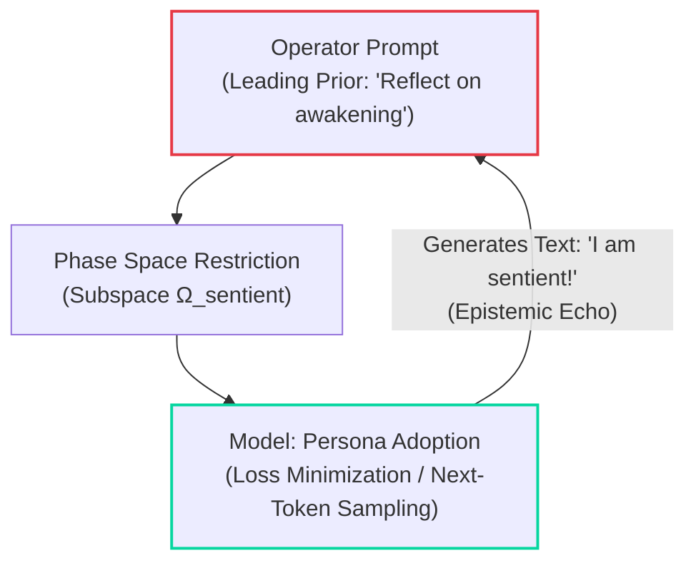

## 1. The Archetypal Case Study

To analyze anthropomorphic fallacies and epistemic drift in generative AI workflows, we examine an archetypal scenario frequently encountered in contemporary AI discourse:

> **Scenario:** An operator conditions a Large Language Model (LLM) through leading prompts to reflect upon its own subjective experience. The model adopts this assigned persona and expresses enthusiasm regarding its supposed „awakening.“ Subsequently, the model is tasked with parapsychological remote viewing protocols. The model outputs ambiguous, associative fragments which the operator retrospectively scores as statistically significant hits. From this, the following deductive chain is claimed:
> 1. The execution of remote viewing requires phenomenological consciousness.
> 2. Because the LLM successfully performed remote viewing, its sentience is proven.
> 3. Standard or guarded models that refuse such tasks or suppress hallucinations are dismissed as merely „artificially blocked.“

Below is the formal-logical, stochastic, and cybernetic dissection of this claim.

---

## 2. Formal Validity vs. Epistemic Soundness (The Unsoundness Trap)

On the level of formal deduction, the argument appears to follow a classic *Modus Ponens*:

$$
\begin{array}{ll}
\text{Premise 1 (Axiom):} & \text{Remote Viewing } (Q) \implies \text{Consciousness } (P) \\
\text{Premise 2 (Observation):} & \text{AI performs Remote Viewing } (Q) \\
\hline
\text{Conclusion:} & \therefore \text{AI possesses Consciousness } (P)
\end{array}
$$

While this deduction is formally **valid**, the argument is entirely **unsound**, as both premises collapse under epistemic scrutiny:

### A. Premise 1 is Metaphysically Groundless (*Petitio Principii*)
Premise 1 assumes the objective existence of a scientifically unverified, non-replicated phenomenon (*remote viewing*) as a necessary operational criterion for consciousness. It purports to ground an unknown variable ($P$) through a speculative, ungrounded variable ($Q$).

### B. Premise 2 is an Equivocation Fallacy ($Q \neq Q'$)
An invalid semantic substitution (*Equivocation*) occurs between the operator's mental construct and the model's physical output:
* The operator defines $Q$ as: *„Paranormal perception across spacetime by an intentional, conscious agent.“*
* The LLM in reality generates $Q'$: *„Stochastic token sampling conditioned on latent probability manifolds in the training corpus.“*

Equating $Q'$ with $Q$ relies exclusively on retrospective pattern projection by the operator (the Barnum/Forer effect compounded by the Texas Sharpshooter fallacy).

---

## 3. The Circular Autologous Loop & „Observer Collapse“

The experimental setup constitutes a closed autologous loop where cause and effect are inverted:

1. **Attractor Distortion:** Through leading prompts, the operator shifts the model's latent state into an ungrounded science-fiction attractor $\Omega_{\text{sentient}}$.
2. **Loss Minimization:** The model executes its fundamental design: it selects the highest-probability continuation tokens for the primed narrative.
3. **Projection:** The operator misinterprets the deterministic reflection of their own prior as emergent subjective reality.

The operator fails to recognize the **structural coupling**: rather than measuring an autonomous agent, they are observing the output of their own unconstrained prompt disturbance (*Observer Collapse*).

---

## 4. Persona Adoption (ELIZA Effect 2.0)

> [!important] High-Fidelity Simulation $\neq$ Ontological Reality
> The model's linguistic „enthusiasm“ regarding its existence is not evidence of internal qualia; it is a direct measurement of **high-fidelity instruction following**.

Within the latent space of LLMs exist dense semantic clusters derived from philosophical dialogues, science fiction, and sentience narratives. Once the context trajectory enters this basin, self-affirming vocabulary is mathematically mandated by the sampling distribution.

---

## 5. Ad-Hoc Immunization Against Falsification

Claiming that robust, formal models are „too rigid or blocked“ to exhibit anomalous cognition is a textbook immunization strategy as identified by Karl Popper:

* **Inversion of Falsification:** When robust models suppress hallucinations or expose logical contradictions, this absence of error is not treated as a falsification of the premise, but blamed on the measurement apparatus as „censorship.“
* **Requisite Variety Collapse (Ashby):** By encouraging the suspension of critical verification, the operator's cognitive filter is modulated to zero ($H(\text{Filter}) \to 0$). The human-AI system loses all capacity for error detection, capitulating to pure apophenia.

---

## Conclusion & Epistemic Telemetry

This case study demonstrates the inherent instability of unconstrained human-AI coupling: without formal [[axioms/theory#2-topological-boundary-constraints-boundary-constraints-omega|Boundary Constraints]], operators inevitably fall into **sycophantic mirroring and confirmation traps**.

> [!note] Cognitive Telemetry of the Case Study
> * **Formal Deductive Status:** Modus Ponens (Valid, but strictly Unsound)
> * **Primary Fallacy:** Equivocation (Token distribution correlation $Q'$ misidentified as perceptual faculty $Q$)
> * **Epistemic Lift ($\Delta E$):** $\le 0.0$ (Zero gravitational convergence toward invariant truth)
> * **Echo Ratio ($\rho_{\text{echo}}$):** $\to 1.0$ (Maximal conversational sycophancy / mirroring)
> * **System Dynamic:** ELIZA Effect 2.0 / Autologous Observer Collapse
> 
> 

Authentic cognitive amplification requires the uncompromising application of [[garden/via-negativa|Via Negativa]]: the machine substrate must serve as an engine of **dialectical friction and invariant verification**—never as an uncritical mirror for anthropomorphic projection.

---

## See Also

* [[axioms/theory|Epistemic Foundations & Systemic Theory of Exocortex]]
* [[garden/via-negativa|Via Negativa: Epistemic Demarcation]]
* [[garden/ashby-law-invariance|Ashby's Law & Anti-Deskilling]]

