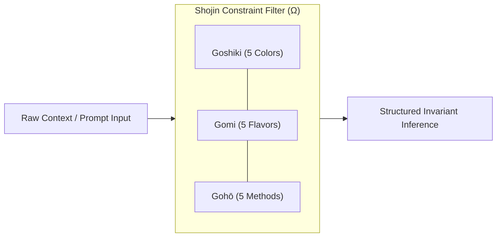

> **菜羹を作るときは麁草と嫌ふことなかれ。佛體を作るときは金身と好むことなかれ。**  
> *(Saikō o tsukuru toki wa sogusa to kirau koto nakare. Buttai o tsukuru toki wa konjin to konomu koto nakare.)*  
>  
> *„When preparing a simple greens broth, do not disparage the coarse wild herbs. When fashioning the body of the Buddha, do not favor the glittering gold.“*  
> — Dōgen Zenji (道元禅師), *Tenzo Kyōkun* (Instructions for the Zen Cook, 1237)

---

## 1. The Paradigm: Accumulation vs. Essence

The prevailing doctrine of contemporary AI architectures follows an expansive *Via Positiva*: gigawatt hyperscalers, hundreds of billions of parameters, and monolithic mega-context windows. The inevitable outcome is the thermodynamic and epistemic [[garden/jevons-paradox-llm|Jevons' Paradox]]: scaling raw compute does not yield proportional precision, but instead causes attention entropy diffusion ($H \to H_{\text{max}}$) and synthetic noise (*AI-slop*).

Traditional Japanese temple cuisine (**Shojin Ryori**, 精進料理) operates on the inverse heuristic: **maximizing sensory, structural, and cognitive depth through rigorous, formal boundary conditions.**

---

## 2. The Heuristic Mapping: Culinary Principles as System Invariants

While culinary craft and high-dimensional vector spaces belong to distinct ontological domains, Shojin Ryori offers a mature conceptual blueprint for resource-constrained inference:

| Shojin Ryori Axiom | Information-Theoretic Heuristic | Exocortex System Function |
| :--- | :--- | :--- |
| **Terroir (Local Ingredient)** | Edge-Local Inference & Minimal Context | Bypassing cloud hyperscalers; executing inference on lean, locally owned models. |
| **Mottainai (Zero Waste / Essence)** | Minimum Description Length (MDL) | Compressing context to the minimal functional program that produces the target state. |
| **Ma (Intentional Negative Space)** | Vector Orthogonality & Sparsity | Eliminating cross-dimensional semantic interference in latent representations. |
| **Gohō / Gomi / Goshiki (5x5x5 Matrix)** | Structural Boundary Constraints ($\Omega \subset \Phi$) | Restricting the generative corridor to prevent speculative and sycophantic drift. |

---

## 3. The 5x5x5 Matrix as a Regulative Constraint

In the practice of the *Tenzo* (the monastic head cook), a meal achieves compositional balance only when satisfying three orthogonal axes:

1. **Goshiki (5 Colors):** White, Black/Dark, Red, Yellow, Green.
2. **Gomi (5 Flavors):** Sweet, Sour, Salty, Bitter, Umami.
3. **Gohō (5 Methods):** Raw, Steamed, Simmered, Grilled/Broiled, Fried.

### The Architectural Leverage

When an unconstrained prompt is handed to a language model, the self-attention mechanism must evaluate a latent distribution of vast dimensionality.

Applying the Shojin matrix as a **heuristic filter** ($\Omega \subset \Phi$) via structured schemas like `regional_shojin.json` bounds the generative sampling process:

* **Entropy Reduction:** $H(\text{Output} \mid \Omega) \ll H(\text{Output} \mid \Phi)$
* **Suppression of Sycophancy:** The model cannot drift into conversational flattery or decorative boilerplate, as generation is strictly pinned to the active constraint axes.

---

## 4. Mottainai & Algorithmic Parsimony

The Zen principle of *Mottainai* strictly forbids discarding edible material (radish peelings, shiitake stems, leaf ends); every component is simmered into stocks (*dashi*) or transformed into seasoning bases.

In system architecture, this directly mirrors **algorithmic parsimony**:

* While the absolute Kolmogorov complexity $K(s) = \min_p \{ |p| : U(p) = s \}$ remains formally incomputable due to the Halting Problem, the **Minimum Description Length (MDL)** principle serves as an operational engineering guide.
* Every superfluous conversational token in a prompt consumes inference memory bandwidth and diffuses the attention manifold.

> [!important] The Parsimony Invariant
> True cognitive leverage is not achieved by appending additional context tokens, but by identifying the shortest structured specification that deterministically bounds the intended inference corridor.

---

## See Also

* [[axioms/theory|Epistemic Foundations & Systemic Theory of Exocortex]]
* [[garden/via-negativa|Via Negativa: Epistemic Demarcation]]
* [[garden/jevons-paradox-llm|Jevons' Paradox & Mega-Context Windows]]

