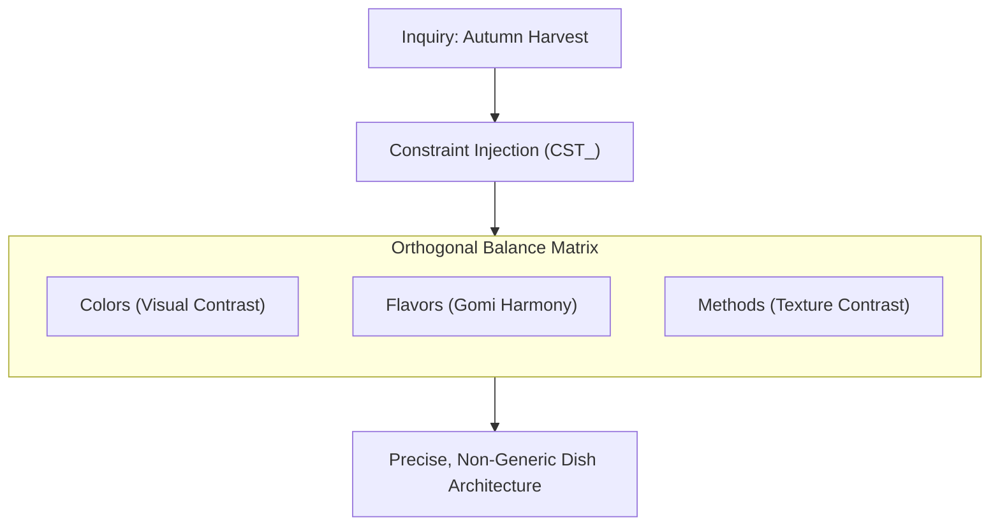

> **菜羹を作るときは麁草と嫌ふことなかれ。佛體を作るときは金身と好むことなかれ。**
> *(Saikō o tsukuru toki wa sogusa to kirau koto nakare. Buttai o tsukuru toki wa konjin to konomu koto nakare.)*
> 
> *"When preparing a simple greens broth, do not disparage the coarse wild herbs. When fashioning the body of the Buddha, do not favor the glittering gold."*  
> — Dōgen Zenji (道元禅師), *Tenzo Kyōkun* (Instructions for the Zen Cook, 1237)

---

## 1. Why a Cooking Graph in a Software Repository?

At first glance, a knowledge graph about Japanese monastic cooking (`regional_shojin`) looks like an odd novelty inside an offline AI architecture project. 

It is not a novelty. It is a **stress-test for domain transfer**.

If an architecture only works for software design reviews, it is not a reasoning engine—it is just a specialized code linter with a chat interface. To prove that Exocortex provides a general-purpose thinking framework, we tested it against a domain that could not be further removed from distributed systems, API gateways, and SQL transactions: **traditional, sensory, artisanal kitchen craft.**

The result: the exact same four graph entities (`Constraint`, `Concept`, `Rule`, `State`) and the exact same 1-hop retrieval mechanics govern both domains with equal rigor.

---

## 2. The Cross-Domain Rosetta Matrix

In *Tenzo Kyōkun* (1237), Dōgen Zenji did not write mystical poetry; he wrote an operational manual for the monastery kitchen under extreme scarcity. The cook worked under absolute boundaries: no meat, no fish, no wasting of edible scraps, and strict reliance on what grew in the valley.

When we map these culinary principles against modern software architecture, the underlying structural invariants are identical:

| Knowledge Graph Entity | Software Architecture (`software_design`) | Regional Shojin Cooking (`regional_shojin`) | Abstract Systems Principle (*Via Negativa*) |
| :--- | :--- | :--- | :--- |
| **`Constraint` (`CST_`)** | **`Side_Effect_Isolation`** Separate pure calculation from I/O and state mutation. | **`Seasonal_and_Regional`** Strictly seasonal, local harvest. No greenhouse imports. | **Inviolable Boundary:** Defines what is strictly forbidden to prevent systemic collapse or incoherence. |
| **`Constraint` (`CST_`)** | **`Single_Responsibility`** A unit does one thing well and has one reason to change. | **`Zero_Waste_Respect`** Peels and trimmings must become stocks, ferments, or seasonings. | **Resource Parsimony:** No bloated "god functions", no discarded materials, no unallocated overhead. |
| **`Concept` (`CNC_`)** | **`Explicit_Boundaries`** Modules communicate via clear, minimal interfaces. | **`Ingredient_Purity`** Highlight natural texture and terroir; do not mask with heavy fats. | **Ground-Truth Axiom:** The core qualitative ideal toward which the system is steered. |
| **`Rule` (`RUL_`)** | **`Defensive_Design`** Fail fast at edges; isolate errors before they spread. | **`Gentle_Techniques`** Dry-toast before boiling; simmer gently to preserve cell walls. | **Action Heuristic:** Concrete transformation rules detailing *how* principles are realized in practice. |
| **`State` (`STA_`)** | **`Design_Review_Active`** Active review trace examining decoupling and testability. | **`Seasonal_Harvest_Active`** Context markers for current cellar stock (e.g., salsify, apples). | **Working Context:** Ephemeral hypotheses and runtime checkpoints tied to the current task. |

---

## 3. The 5×5×5 Matrix: Constraints as a Combinatorial Engine

In the Shojin tradition, a meal is balanced across three orthogonal axes:

1. **Goshiki (5 Colors):** White, Black/Dark, Red, Yellow, Green.
2. **Gomi (5 Flavors):** Sweet, Sour, Salty, Bitter, Umami.
3. **Gohō (5 Methods):** Raw, Steamed, Simmered, Grilled/Broiled, Fried.

### Why This Matters for LLMs

If you give an unconstrained local model an open prompt:

> *"Suggest an autumn dinner recipe."*

The model falls back to the statistical mean of its training data: pumpkin soup with cream or generic roasted root vegetables. It produces polite, predictable filler.

When you inject the `regional_shojin` graph:

* **The Boundaries (`CST_`):** Only garden-harvested items (black salsify, Boskoop apples, buckwheat). No cream, no store-bought vegetable broth cubes.
* **The Balance (`CST_003`):** Must balance earthy umami, fruit acidity, crisp grain textures, and braised root tenderness.
* **The Retrieved Graph (`CNC_001`):** The model pulls `Vegetable_Dashi_Base` via 1-hop traversal and suggests boiling the buckwheat in root-peel broth.

By constraining the solution space, the model stops hallucinating platitudes and is forced to solve a precise combinatorial problem.

---

## 4. Mottainai & Context Economy

The Zen concept of *Mottainai* (勿体無い) expresses regret over waste. Radish tops, squash skins, and kombu trimmings are never thrown into the compost—they are simmered into broths or preserved.

In LLM engineering, **tokens are produce**:

* **Dumping context is sloppy cooking:** Flooding an LLM with 50,000 tokens of conversational filler, raw dumps, and defensive boilerplate degrades model attention ("lost in the middle") and inflates inference latency.
* **Treating context with respect:** Passing a compact, highly structured context frame (< 400 tokens) of active constraints and connected nodes keeps a local 12B model sharply focused, predictable, and fast—preventing attention degradation without needing massive parameter counts to to filter out conversational noise.

Restraint is not a compromise imposed by weak hardware; it is a conscious architectural discipline.

---

## See Also

* [[axioms/theory|Mental Models & Knowledge Graphs]]
* [[axioms/ethics|Human Agency & Sparring Principles]]
* [Showcase 02: Regional Shojin Recipe Benchmark](https://github.com/ghosoya/exocortex/blob/main/docs/topologies/02_regional_shojin_recipe.md)
