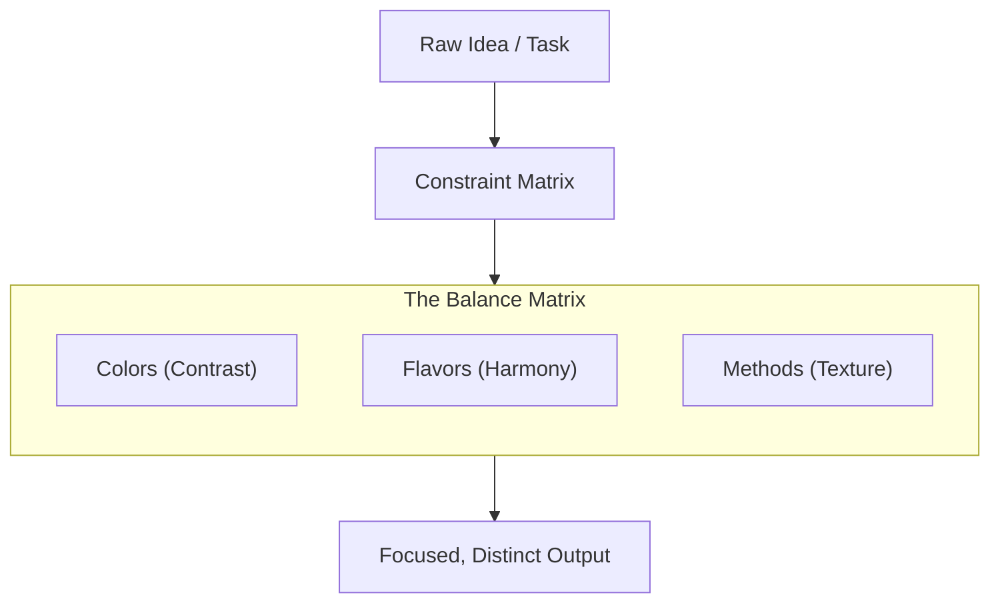

> **菜羹を作るときは麁草と嫌ふことなかれ。佛體を作るときは金身と好むことなかれ。**  
> *(Saikō o tsukuru toki wa sogusa to kirau koto nakare. Buttai o tsukuru toki wa konjin to konomu koto nakare.)*  
>   
> *"When preparing a simple greens broth, do not disparage the coarse wild herbs. When fashioning the body of the Buddha, do not favor the glittering gold."*  
> — Dōgen Zenji (道元禅師), *Tenzo Kyōkun* (Instructions for the Zen Cook, 1237)

---

## 1. More is Not Better: Accumulation vs. Essence

The default reflex in modern technology is to solve problems through accumulation: larger models, bigger context windows, and sprawling frameworks. 

Yet in practice, an unconstrained prompt handed to a language model often produces the exact opposite of quality: generic, beige prose that averages out everything and says nothing specific. When everything is permitted, focus dissolves.

Traditional Japanese temple cuisine (**Shojin Ryori**, 精進料理) was built on the inverse principle: **depth, flavor, and creativity emerge from rigorous, intentional boundaries.**

---

## 2. The Discipline of the Tenzo

In Zen practice, the role of the *Tenzo* (the monastic head cook) is not a mundane chore, but a core spiritual discipline. Monks cooked under strict prohibitions: no meat, no fish, no alcohol, and no pungent roots (like garlic or onions) that overwhelm delicate tastes.

Instead of fighting these constraints or compensating with artificial flavor enhancers, the Tenzo used them to sharpen perception:

| Principle | Culinary Practice | System & Design Analogy |
| :--- | :--- | :--- |
| **Local Terroir** | Cook only what grows in the immediate valley and season. | Work with lean, local models and your own notes rather than outsourcing everything to the cloud. |
| **Mottainai (Zero Waste)** | Scraps, peels, and stems become flavorful stocks (*dashi*). | Eliminating conversational filler; making every word and token count. |
| **Ma (Negative Space)** | Leaving space between dishes; not overwhelming the palate. | Keeping contexts compact so the model focuses on the core problem without distraction. |
| **The 5×5×5 Matrix** | Balancing 5 colors, 5 flavors, and 5 preparation methods. | Structured constraints that force balanced, creative solutions rather than generic defaults. |

---

## 3. The 5×5×5 Matrix: Constraints as a Creative Engine

To ensure a meal is nutritionally sound and aesthetically harmonious without using animal products, the Shojin tradition relies on a formal balance of three orthogonal axes:

1. **Goshiki (5 Colors):** White, Black/Dark, Red, Yellow, Green.
2. **Gomi (5 Flavors):** Sweet, Sour, Salty, Bitter, Umami.
3. **Gohō (5 Methods):** Raw, Steamed, Simmered, Grilled/Broiled, Fried.

### Why This Matters for Prompts and Software

When you ask an AI a broad, open-ended question like:

> *"Suggest an autumn dinner recipe."*

you get an average, predictable answer: pumpkin soup with cream and toasted seeds.

When you apply the Shojin constraint matrix (as implemented in our `regional_shojin.json` topology):

* **Ingredients:** Regional autumn produce only (beetroot, black salsify, boskoop apple, buckwheat).
* **Flavor Rule:** Balance earthy bitterness with fruit acidity and a gentle kombu/peel dashi.
* **Texture Rule:** Contrast crisp roasted grains with tender simmered root vegetables.

Suddenly, the playground has walls. The model can no longer rely on cliché fallback answers. It is forced to solve a specific combinatorial puzzle—and the resulting suggestions are distinct, cohesive, and grounded.

---

## 4. Mottainai: The Value of Every Element

The Zen principle of *Mottainai* (勿体無い) expresses regret over waste. In the monastery kitchen, radish peelings, squash skins, and dried shiitake stems are never discarded; they are roasted, simmered into concentrated broths, or pickled.

In system design, this is the essence of **parsimony**:

* **Every piece of context costs attention:** Flooding a model with hundreds of lines of boilerplate code or polite conversational pleasantries dilutes its focus.
* **Respect the raw material:** A concise, well-structured prompt of 150 tokens containing clear boundaries regularly outperforms an unstructured 2,000-token brain dump.

Restraint is not a compromise made due to lack of resources; it is a conscious method for bringing out the essential character of the work.

---

## See Also

* [[axioms/theory|Mental Models & Knowledge Graphs]]
* [[axioms/ethics|Human Agency & Sparring Principles]]

