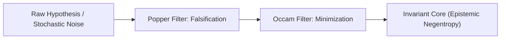

> *"We know a lot more what is wrong than what is right."*  
> — Nassim Nicholas Taleb, *Antifragile*

---

## 1. The Accumulation Fallacy (*Via Positiva*)

The classical epistemic illusion of modern information architectures rests on an additive fallacy:

$$\text{Knowledge} \neq \sum \text{Information}$$

In the era of generative language models, accumulating unconstrained tokens, parameters, and facts does not yield cognitive clarity; it generates epistemic overload and stochastic noise. Attempting to approximate truth by continuously adding conversational layers inevitably triggers **confabulation** and the [[garden/jevons-paradox-llm|Jevons' Paradox of attention]].

---

## 2. The Subtractive Method

The **Via Negativa** (the negative way) inverts the epistemic vector. Knowledge acquisition progresses not through the affirmative accumulation of hypotheses, but through the **rigorous elimination of the false, the fragile, and the inconsistent**.

### The Three Pillars of Via Negativa

| Principle | Operational Mechanism | Function in the Exocortex |
| --- | --- | --- |
| **Popperian Falsification** | Asymmetry of verification: truths cannot be conclusively proven, but errors can be definitively falsified. | Machine inference outputs are primarily evaluated against invariant boundaries and contradiction checks. |
| **Occam’s Razor** | *Entia non sunt multiplicanda praeter necessitatem.* | Excising ungrounded metaphysical assumptions and ad-hoc defensive wrappers. |
| **Mottainai / Kolmogorov** | Compressing representations to their shortest functional description length $K(s)$. | Eliminating narrative flattery and conversational noise ([[garden/shojin-isomorphism |

---

## 3. Formal Falsification via Modus Tollens

While affirmative confirmation (*verification*) is logically invalid (the formal fallacy of affirming the consequent), subtractive elimination possesses absolute deductive validity via **Modus Tollens**:

$$
\begin{array}{ll}
\text{Premise 1:} & \text{Hypothesis } (H) \implies \text{Prediction } (P) \\
\text{Premise 2:} & \text{Empirical Observation demonstrates } \neg P \\
\hline
\text{Conclusion:} & \therefore \neg H \quad \text{(Hypothesis is formally falsified)}
\end{array}
$$

A single robust counter-instance outweighs ten thousand affirmative echoes.

---

## 4. Application to Human-AI Symbiosis

In an epistemically sovereign system, a language model is **not** tasked with confirming the operator's unexamined priors (*Anti-Sycophancy*). Its primary raison d'être is **dialectical resistance**:

1. Exposing covert circular reasoning (*petitio principii*).
2. Detecting equivocation (unwarranted semantic drift).
3. Stress-testing edge cases and invariant boundaries.

Truth is the topological invariant that remains after all falsification vectors have failed to break the structure.

---

## See Also

* [[axioms/theory|Epistemic Foundations & Systemic Theory of Exocortex]]
* [[garden/shojin-isomorphism|Shojin Ryori & Vector Topology: The Art of Formal Constraint]]
* [[dispatches/2026-08-25-deconstructing-remote-viewing-ai|Dispatch 001: High-Fidelity Simulation vs. Ontological Reality]]

